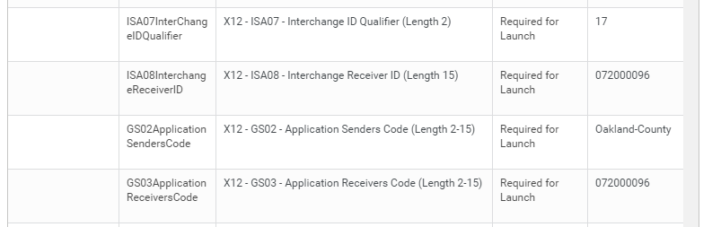

WD Oakland County Michigan : INT214 Huntington ACH CTX Outbound  

1.  [WD Oakland County Michigan](index.html)
2.  [Integration](Integration_73138773.html)
3.  [Phase 2 Integrations - Financials](Phase-2-Integrations---Financials_128288889.html)
4.  [Phase 2 - Design Documents](Phase-2---Design-Documents_128288892.html)

WD Oakland County Michigan : INT214 Huntington ACH CTX Outbound
===============================================================

Created by Haddad, Basil F. on Dec 15, 2020

  

  

  

   

 

[File](/tapp-confluence/display/OAK/INT214+Huntington+ACH+CTX+Outbound?sortBy=name&sortOrder=ascending)

[Modified](/tapp-confluence/display/OAK/INT214+Huntington+ACH+CTX+Outbound?sortBy=date&sortOrder=descending)

Microsoft Word Document [ACH Validation Knowledge Transfer.docx](/tapp-confluence/download/attachments/159974822/ACH%20Validation%20Knowledge%20Transfer.docx?api=v2 "Download")

Dec 15, 2020 by [Haddad, Basil F.](    /tapp-confluence/display/~basil.f.haddad
)

Labels

*   No labels
*   [Edit Labels](# "Edit Labels")

Preview [$itemLabel]($itemRenderedUrl) [$itemLabel]($itemRenderedUrl&isFromPageView=true) [$itemLabel]($itemRenderedUrl&isFromPageView=true)

Microsoft Word Document [ACH\_Manual\_Run Knowledge Transfer.docx](/tapp-confluence/download/attachments/159974822/ACH_Manual_Run%20Knowledge%20Transfer.docx?api=v2 "Download")

Dec 15, 2020 by [Haddad, Basil F.](    /tapp-confluence/display/~basil.f.haddad
)

Labels

*   No labels
*   [Edit Labels](# "Edit Labels")

Preview [$itemLabel]($itemRenderedUrl&isFromPageView=true) [$itemLabel]($itemRenderedUrl&isFromPageView=true&isFromPageView=true) [$itemLabel]($itemRenderedUrl&isFromPageView=true&isFromPageView=true)

PNG File [image2021-3-2\_12-46-29.png](/tapp-confluence/download/attachments/159974822/image2021-3-2_12-46-29.png?api=v2 "Download")

Mar 02, 2021 by [Lisa Johnson](    /tapp-confluence/display/~lisa.johnson
)

Labels

*   No labels
*   [Edit Labels](# "Edit Labels")

Preview [$itemLabel]($itemRenderedUrl&isFromPageView=true&isFromPageView=true&isFromPageView=true) [$itemLabel]($itemRenderedUrl&isFromPageView=true&isFromPageView=true&isFromPageView=true)

Microsoft Word 97 Document [CTX\_NACHAFileFormat.doc](/tapp-confluence/download/attachments/159974822/CTX_NACHAFileFormat.doc?api=v2 "Download")

May 24, 2022 by [Lisa Johnson](    /tapp-confluence/display/~lisa.johnson
)

Labels

*   No labels
*   [Edit Labels](# "Edit Labels")

Preview [$itemLabel]($itemRenderedUrl&isFromPageView=true&isFromPageView=true&isFromPageView=true) [$itemLabel]($itemRenderedUrl&isFromPageView=true&isFromPageView=true&isFromPageView=true&isFromPageView=true) [$itemLabel]($itemRenderedUrl&isFromPageView=true&isFromPageView=true&isFromPageView=true&isFromPageView=true)

Microsoft Excel Sheet [INT214 Huntington AP ACH CTX Outbound.xlsm](/tapp-confluence/download/attachments/159974822/INT214%20Huntington%20AP%20ACH%20CTX%20Outbound.xlsm?api=v2 "Download")

Jun 12, 2022 by [James Walsh](    /tapp-confluence/display/~james.r.walsh
)

Labels

*   No labels
*   [Edit Labels](# "Edit Labels")

Preview [$itemLabel]($itemRenderedUrl&isFromPageView=true&isFromPageView=true&isFromPageView=true&isFromPageView=true&isFromPageView=true) [$itemLabel]($itemRenderedUrl&isFromPageView=true&isFromPageView=true&isFromPageView=true&isFromPageView=true&isFromPageView=true)

*   Drag and drop to upload or browse for files 

Upload file 

File description  

[Download All](/tapp-confluence/pages/downloadallattachments.action?pageId=159974822 "Download all the latest versions of attachments on this page as single zip file.")

Attachments:
------------

 [ACH Validation.docx](attachments/159974822/159974823.docx) (application/vnd.openxmlformats-officedocument.wordprocessingml.document)  
 [ACH\_Manual\_Run.docx](attachments/159974822/159974824.docx) (application/vnd.openxmlformats-officedocument.wordprocessingml.document)  
 [INT210 Huntington ACH PPD Cash Advances Outbound.xlsm](attachments/159974822/159974825.xlsm) (application/vnd.ms-excel.sheet.macroenabled.12)  
 [INT214 Huntington AP ACH CTX Outbound.xlsm](attachments/159974822/159977500.xlsm) (application/vnd.ms-excel.sheet.macroenabled.12)  
 [ACH Validation Knowledge Transfer.docx](attachments/159974822/159974828.docx) (application/vnd.openxmlformats-officedocument.wordprocessingml.document)  
 [ACH\_Manual\_Run Knowledge Transfer.docx](attachments/159974822/159974829.docx) (application/vnd.openxmlformats-officedocument.wordprocessingml.document)  
 [CTX\_NACHAFileFormat.doc](attachments/159974822/159974836.doc) (application/msword)  
 [INT214 Huntington AP ACH CTX Outbound.xlsm](attachments/159974822/161288972.xlsm) (application/vnd.ms-excel.sheet.macroenabled.12)  
 [INT214 Huntington AP ACH CTX Outbound.xlsm](attachments/159974822/161290024.xlsm) (application/vnd.ms-excel.sheet.macroenabled.12)  
 [INT214 Huntington AP ACH CTX Outbound.xlsm](attachments/159974822/276365496.xlsm) (application/vnd.ms-excel.sheet.macroenabled.12)  
 [image2021-3-2\_12-46-29.png](attachments/159974822/164040738.png) (image/png)  
 [CTX\_NACHAFileFormat.doc](attachments/159974822/270422304.doc) (application/msword)  
 [INT214 Huntington AP ACH CTX Outbound.xlsm](attachments/159974822/159974827.xlsm) (application/vnd.ms-excel.sheet.macroEnabled.12)  

Comments:
---------

[Natalie Neph](https://rit.accenture.com/tapp-confluence/display/~natalie.neph) [Hazel Wallace](https://rit.accenture.com/tapp-confluence/display/~hazel.wallace) [Lisa Johnson](https://rit.accenture.com/tapp-confluence/display/~lisa.johnson)

Something we need to sign off and review, just like we did with [Haddad, Basil F.](https://rit.accenture.com/tapp-confluence/display/~basil.f.haddad) for INT207-Huntington BAI file, except this is outgoing CXT for payments from Oakland County to Suppliers. Business to Business with addenda information.

 Posted by lisa.johnson at Jan 26, 2021 05:52

 Posted by lisa.johnson at Mar 02, 2021 07:46

Need to understand how this number (build in the integration above) relates in Workday, because it is showing in the addenda information in the CTX file, but it is an old Comerica ABA. Did it come from Conversion...we used to use Comerica. Can we have it updated?

  

[Julie Maynard](https://rit.accenture.com/tapp-confluence/display/~julie.maynard) [Natalie Neph](https://rit.accenture.com/tapp-confluence/display/~natalie.neph) [James Walsh](https://rit.accenture.com/tapp-confluence/display/~james.r.walsh) [Edward Schmerling](https://rit.accenture.com/tapp-confluence/display/~edward.l.schmerling)

 Posted by lisa.johnson at Mar 02, 2021 07:49

After change in ABA from Comerica to Huntington. Signing off on Design for standard NACHA format. NOTE: Peoplesoft is not using a standard NACHA format, so cannot compare completely. Tested after changing the ABA in the addenda information, and items still presented, so nothing is effecting Workday pulling information for the Addenda, like invoice and payment dates and supplier aba.

Signing off on design, as configured in Oakgov8, for CTX. [James Walsh](https://rit.accenture.com/tapp-confluence/display/~james.r.walsh) [Hazel Wallace](https://rit.accenture.com/tapp-confluence/display/~hazel.wallace) [Natalie Neph](https://rit.accenture.com/tapp-confluence/display/~natalie.neph)

 Posted by lisa.johnson at Mar 09, 2021 14:40

Document generated by Confluence on Jul 21, 2022 08:32

[Atlassian](http://www.atlassian.com/)